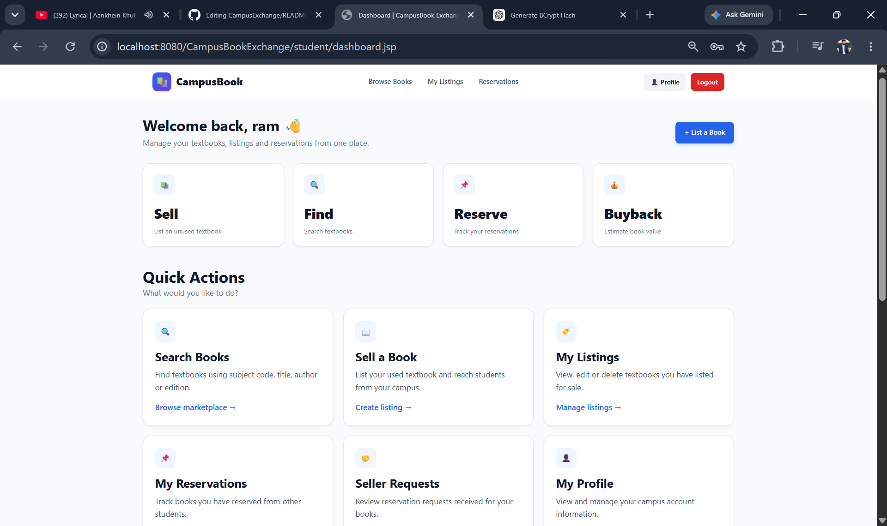
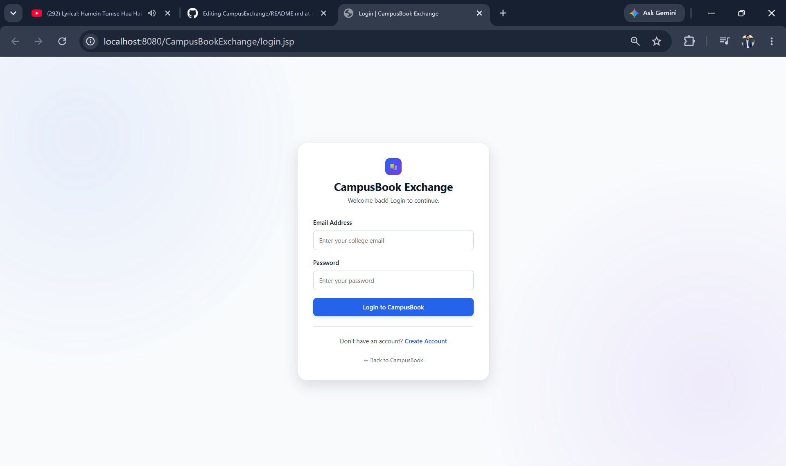

📚 CampusBook Exchange

A College-Focused Second-Hand Textbook Marketplace

  <strong>Buy • Sell • Search • Reserve • Reuse</strong>

  
  
  
  
  

  <a href="#-features">Features</a> •
  <a href="#-screenshots">Screenshots</a> •
  <a href="#-architecture">Architecture</a> •
  <a href="#-installation">Installation</a> •
  <a href="#-future-improvements">Future Improvements</a>

📖 About The Project

CampusBook Exchange is a college-focused web application that helps students buy and sell second-hand academic textbooks.

Students often purchase expensive textbooks for a semester and then struggle to find relevant buyers after completing their courses. Existing platforms such as general marketplaces or messaging groups are not designed specifically around academic requirements.

CampusBook Exchange provides a structured marketplace where students can discover books using:

Department

Semester

Subject Code

Subject Name

Book Title

Author

Edition

Book Condition

The application also provides a complete buyer-seller reservation workflow, listing management, authentication, and an estimated textbook buyback value.

🎯 Problem Statement

College students spend a significant amount of money on textbooks that may only be required for one semester. After completing the course, finding the right buyer can be difficult.

CampusBook Exchange aims to solve this problem by creating a centralized platform specifically for students, making textbook discovery and resale easier and more organized.

💡 Solution

The application connects students who want to sell unused textbooks with students looking for affordable second-hand books.

Seller
  │
  ├── Add Book
  ├── Manage Listing
  └── Receive Reservation
            │
            ▼
       CampusBook Exchange
            │
            ▼
          Buyer
  ├── Search Book
  ├── View Details
  └── Reserve Book

✨ Features

👤 Authentication

Student registration

Secure login

BCrypt password hashing

Session-based authentication

Logout functionality

Authentication filter for protected pages

📚 Book Marketplace

Students can:

Add textbooks

Edit their listings

Delete available listings

View their own listings

Set book condition

Set original and selling prices

Add book descriptions

Track book status

Supported Book Status

Status

Description

🟡 AVAILABLE

Book is available for reservation

🔵 RESERVED

Book currently has an active reservation

🟢 SOLD

Seller accepted the reservation

🔴 REJECTED

Reservation was rejected

⚪ CANCELLED

Reservation was cancelled

🔎 Book Search

Books can be searched using multiple academic and book-related fields.

Search
  │
  ├── Title
  ├── Author
  ├── Edition
  ├── Subject Code
  └── Subject Name

This makes the platform more suitable for academic book discovery than a generic marketplace.

📌 Reservation System

CampusBook Exchange provides a complete buyer-seller reservation workflow.

Buyer
  │
  │ Reserve Book
  ▼
PENDING
  │
  ├───────────────┐
  ▼               ▼
ACCEPTED        REJECTED
  │               │
  ▼               ▼
 SOLD          AVAILABLE

Reservation Statuses

Status

Meaning

PENDING

Buyer has requested the book

ACCEPTED

Seller accepted the request

REJECTED

Seller rejected the request

CANCELLED

Buyer cancelled the request

SOLD

Book was successfully accepted/sold

💰 Buyback Valuation

The application includes a simple estimated textbook buyback calculator.

The estimated value depends on:

Original book price

Book condition

Edition age

Condition-Based Valuation

Condition

Base Value

NEW

80%

LIKE_NEW

70%

GOOD

60%

FAIR

45%

POOR

30%

Edition age applies an additional reduction according to the application's valuation rules, with a minimum valuation threshold.

⚠️ Note: This is an educational project calculation and does not represent a guaranteed market or resale price.

🎨 User Interface

The application includes a modern responsive interface with:

🏠 Landing page

🔐 Login page

📝 Registration page

📊 Student dashboard

📚 Book search

📖 Book details

➕ Add book

📋 My listings

📌 Reservations

👤 Profile

🌙 Dark mode

📱 Responsive layouts

📸 Screenshots

Add your real screenshots to the screenshots/ directory using the filenames below.

🏠 Home Page

🔐 Login

📝 Registration

📊 Student Dashboard

🔎 Search Books

📖 Book Details

➕ Add Book

📋 My Listings

📌 Reservations

👤 Profile

🌙 Dark Mode

🛠️ Technology Stack

Technology

Usage

☕ Java

Backend development

🌐 JSP

Dynamic web pages

⚙️ Servlets

HTTP request handling

🔌 JDBC

Database connectivity

🐬 MySQL

Relational database

🎨 HTML5

Frontend structure

🎨 CSS3

Styling and responsive UI

🔐 jBCrypt

Password hashing

🖥️ Apache Tomcat 10.1

Web application server

🧰 Eclipse / IDE

Development environment

🏗️ Architecture

CampusBook Exchange follows a layered MVC-style architecture.

┌──────────────────────────────┐
│          Browser             │
│       JSP / HTML / CSS       │
└──────────────┬───────────────┘
               │
               ▼
┌──────────────────────────────┐
│          Servlets            │
│       Controller Layer       │
└──────────────┬───────────────┘
               │
               ▼
┌──────────────────────────────┐
│            DAO               │
│       Data Access Layer      │
└──────────────┬───────────────┘
               │
               ▼
┌──────────────────────────────┐
│            JDBC              │
└──────────────┬───────────────┘
               │
               ▼
┌──────────────────────────────┐
│           MySQL              │
│          Database            │
└──────────────────────────────┘

Request Flow

JSP
 ↓
Servlet
 ↓
DAO
 ↓
JDBC
 ↓
MySQL
 ↓
DAO
 ↓
Servlet
 ↓
JSP

📂 Project Structure

CampusBookExchange/
│
├── src/main/java/com/campusbook/
│   │
│   ├── controller/
│   │   ├── TestConnectionServlet.java
│   │   ├── LoginServlet.java
│   │   ├── RegisterServlet.java
│   │   ├── AddBookServlet.java
│   │   ├── MyListingsServlet.java
│   │   ├── SearchBookServlet.java
│   │   ├── BookDetailsServlet.java
│   │   ├── ReserveBookServlet.java
│   │   ├── MyReservationsServlet.java
│   │   ├── CancelReservationServlet.java
│   │   ├── SellerReservationServlet.java
│   │   ├── ManageReservationServlet.java
│   │   ├── EditBookServlet.java
│   │   ├── UpdateBookServlet.java
│   │   ├── DeleteBookServlet.java
│   │   ├── BuybackServlet.java
│   │   └── LogoutServlet.java
│   │
│   ├── dao/
│   │   ├── UserDAO.java
│   │   ├── BookDAO.java
│   │   ├── ReservationDAO.java
│   │   └── BuybackDAO.java
│   │
│   ├── model/
│   │   ├── User.java
│   │   ├── Book.java
│   │   ├── Reservation.java
│   │   └── Buyback.java
│   │
│   ├── util/
│   │   ├── DBConnection.java
│   │   └── PasswordUtil.java
│   │
│   └── filter/
│       └── AuthenticationFilter.java
│
├── src/main/webapp/
│   │
│   ├── index.jsp
│   ├── login.jsp
│   ├── register.jsp
│   │
│   ├── css/
│   │   └── style.css
│   │
│   ├── js/
│   │
│   ├── images/
│   │
│   ├── student/
│   │   ├── dashboard.jsp
│   │   ├── add-book.jsp
│   │   ├── edit-book.jsp
│   │   ├── my-listings.jsp
│   │   ├── my-reservations.jsp
│   │   ├── profile.jsp
│   │   ├── buyback.jsp
│   │   └── buyback-result.jsp
│   │
│   ├── books/
│   │   ├── search.jsp
│   │   ├── book-details.jsp
│   │   └── search-results.jsp
│   │
│   └── error/
│       ├── 404.jsp
│       └── 500.jsp
│
├── screenshots/
│   ├── home.png
│   ├── login.png
│   ├── register.png
│   ├── dashboard.png
│   ├── search-books.png
│   ├── book-details.png
│   ├── add-book.png
│   ├── my-listings.png
│   ├── reservations.png
│   ├── profile.png
│   └── dark-mode.png
│
└── README.md

🗄️ Database Design

The project uses MySQL as its relational database.

Database

CREATE DATABASE campus_book_exchange;

Main Tables

┌───────────────┐
│     users     │
└───────┬───────┘
        │
        │ seller_id / buyer_id
        ▼
┌───────────────┐
│     books     │
└───┬───────┬───┘
    │       │
    │       └───────────────┐
    ▼                       ▼
┌───────────────┐    ┌───────────────┐
│    subjects   │    │  reservations │
└───────┬───────┘    └───────────────┘
        │
        ▼
┌───────────────┐
│  departments  │
└───────────────┘

books
  │
  ▼
buyback

Tables

Table

Purpose

users

Student account information

departments

Academic departments

subjects

Subject and semester information

books

Textbook listings

reservations

Buyer reservation requests

buyback

Estimated textbook valuation

🔐 Security

Password Hashing

Passwords are hashed using BCrypt before storage.

String hashedPassword =
        PasswordUtil.hashPassword(password);

Password verification uses BCrypt rather than comparing plaintext passwords.

Authentication Filter

Protected student routes are checked using a Servlet Filter.

               HTTP Request
                    │
                    ▼
        ┌─────────────────────┐
        │ AuthenticationFilter│
        └──────────┬──────────┘
                   │
             Logged In?
              /       \
            YES        NO
             │          │
             ▼          ▼
        Requested      Login
           Page         Page

Session Management

The authenticated user is stored in the HTTP session and protected routes verify the session before granting access.

⚙️ Installation

1. Clone The Repository

git clone https://github.com/YOUR_USERNAME/CampusBookExchange.git

cd CampusBookExchange

2. Create Database

Open MySQL:

CREATE DATABASE campus_book_exchange;

USE campus_book_exchange;

Create the following tables:

users
departments
subjects
books
reservations
buyback

Then insert the required department and subject data.

3. Configure MySQL

Open:

src/main/java/com/campusbook/util/DBConnection.java

Update your credentials:

private static final String URL =
        "jdbc:mysql://localhost:3306/campus_book_exchange";

private static final String USER =
        "root";

private static final String PASSWORD =
        "YOUR_MYSQL_PASSWORD";

Do not commit your real database password to GitHub.

4. Required Dependencies

Make sure the project has:

MySQL Connector/J

jBCrypt

Jakarta Servlet API compatible with Tomcat 10.1

5. Configure Apache Tomcat

Recommended environment:

Java       : 21+
MySQL      : 8.x
Tomcat     : 10.1.x

Deploy the project to Apache Tomcat and start the server.

6. Run The Application

Open:

http://localhost:8080/CampusBookExchange/

🧪 Testing Flow

Test the complete application using the following workflow:

1. Register
      ↓
2. Login
      ↓
3. Add Book
      ↓
4. Search Book
      ↓
5. View Book Details
      ↓
6. Reserve Book
      ↓
7. Login as Seller
      ↓
8. View Requests
      ↓
9. Accept / Reject
      ↓
10. Verify Book Status

🧩 Main Modules

Student Module

Registration
Login
Dashboard
Profile
Add Book
Edit Book
Delete Book
My Listings
Search Books
Book Details
Reservations
Buyback
Logout

Seller Module

My Listings
Reservation Requests
Buyer Information
Accept Reservation
Reject Reservation
Book Status Management

🎯 Project Objectives

Build a centralized textbook marketplace for college students.

Make academic books easier to discover.

Reduce textbook expenses through second-hand sales.

Provide a structured buyer-seller reservation workflow.

Allow students to manage their own listings.

Provide an estimated buyback value.

Practice Java web development using Servlets, JSP, JDBC, and MySQL.

Implement authentication and session-based authorization.

📈 Future Improvements

The following features can be added in future versions:

💳 Online payment integration

📍 Campus/location-based listings

⭐ Seller ratings and reviews

💬 Buyer-seller messaging

🔔 Email notifications

📱 Android/mobile application

🖼️ Book image upload

🔎 Advanced filtering

❤️ Wishlist/favorites

📊 Admin analytics dashboard

🧑‍💼 Admin user management

📦 Order and delivery tracking

🤖 AI-powered book recommendations

🧠 Learning Outcomes

This project provided practical experience with:

Java Web Development

JSP

Servlets

MVC architecture

JDBC

MySQL

SQL CRUD operations

SQL joins and relationships

Foreign keys

HTTP GET/POST

Session management

Servlet Filters

BCrypt password hashing

Tomcat deployment

Responsive frontend development

Buyer-seller transaction workflows

👨‍💻 Author

Isa Abdul Kadri

B.Tech Computer Science Engineering
Sandipani Technical Campus

  <code>Java</code>
  <code>JSP</code>
  <code>Servlets</code>
  <code>JDBC</code>
  <code>MySQL</code>
  <code>HTML</code>
  <code>CSS</code>
  <code>Tomcat</code>

⭐ Support

If you find this project useful, consider giving the repository a ⭐.

📚 CampusBook Exchange

Making textbook resale easier for students.

📄 License

This project was developed for educational and portfolio purposes.
